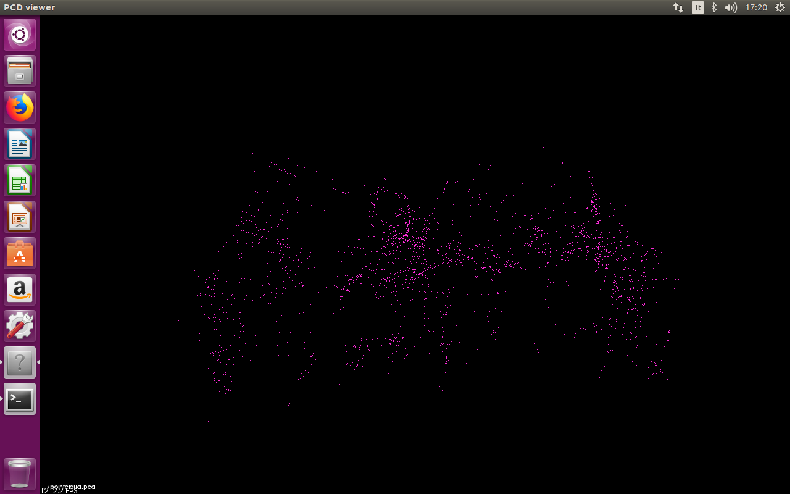
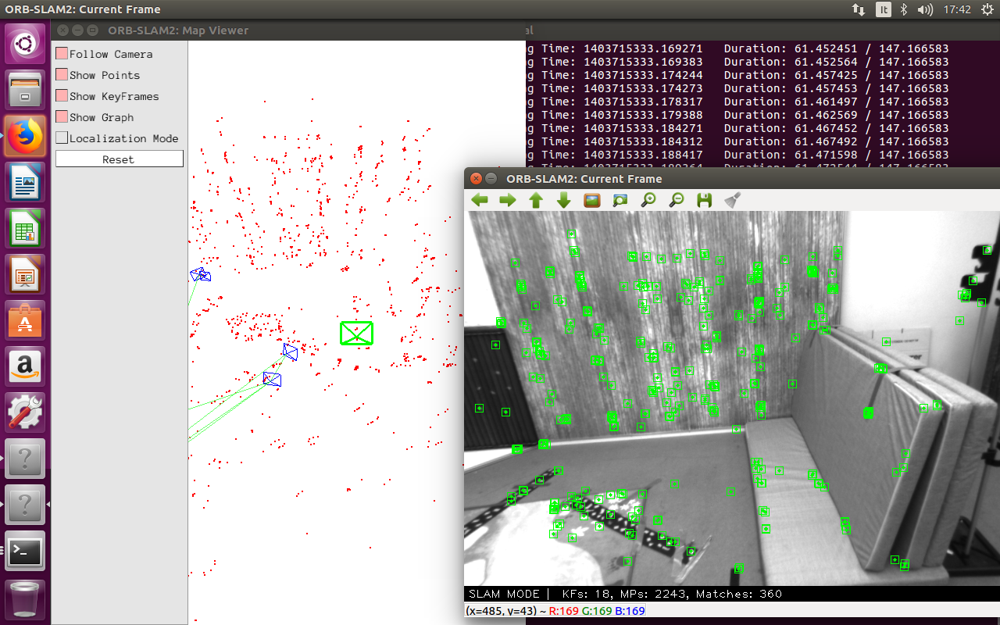
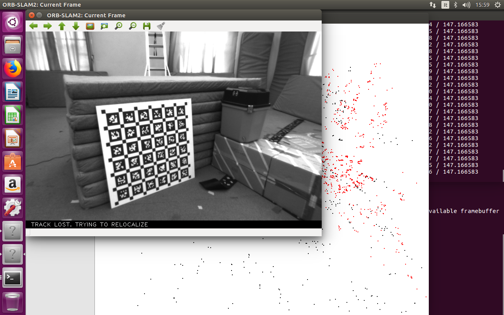

# ros_homework_3

## Compilazione
Dopo aver clonato la repository, eseguire lo script `build.sh`
```
git clone https://github.com/mirkomorati/ros_homework_3.git
cd ros_homework_3
./build.sh
```

## Esecuzione
Eseguire lo script `run.sh`, passare come argomento il path della bag se necessario (default `~/V1_01_easy.bag`).

## Modifiche
Per salvare il file `.pcd` ho aggiunto una funzione `SavePCD` al file `System.cc` basandomi sul seguente post: [link](https://medium.com/@j.zijlmans/orb-slam-2052515bd84c)

L'algoritmo di clusterizzazione si può trovare nella documentazione della libreria `pcl`: [link](http://www.pointclouds.org/documentation/tutorials/cluster_extraction.php)

Ho dovuto fixare il file `CMakelists.txt` dentro l'esempio `ROS` in `ORB_SLAM2` basandomi sulla issue [#535](https://github.com/raulmur/ORB_SLAM2/issues/535)

## Clusterizzazione
```
cd cluster
./cluster_extraction [file.pcd] [clusterTolerance]
```

Come parametro per la `clusterTolerance` ho dovuto utilizzare `0.40` in quanto il mio computer non riesce a produrre una pointcloud abbastanza fitta.

## Screenshots

#### Risultato cluster


#### Pointcloud


#### Generazione pointcloud


